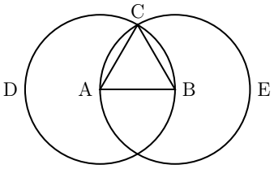
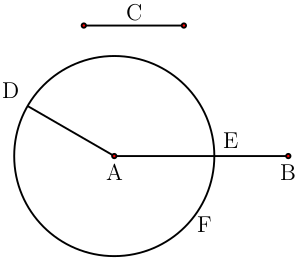
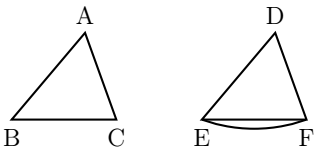
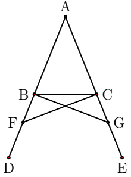
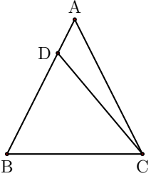

本系列文章参考内容、图片来自 [大哉言数](http://www.mathsgreat.com/SC/index.html)

## 前言


我与先生（利玛窦，明朝万历年间意大利传教士）交游日久，谈道之余常涉此学（即为数学，前文中徐光启认为数学非常重要），遂请其出示象数诸书，更译为华文。先生独言：此书（即几何原本）若不先译，则他书皆难理解。于是共译其精要六卷。译事既成，反复研读，方知其“由浅入深，由疑得信”，看似“无用”实为“众用之基”，真可谓包容万象之形、汇聚百家之学的海洋。虽未尽全书之妙，然以此为基，他书皆可循理而论。


明朝万历时期徐光启在了解几何原本后感叹到其精妙。徐光启认为数学是非常重要的基础学科，器械、历法、音律都是掌握数学的精妙而做到的，徐光启同时还看到中国的古典数学在秦始皇焚书后便失传，后世的数学就像盲人射箭般凭臆测猜想，或者仅仅模仿前人，几乎废绝；而几何原本则是徐光启认为的数学之根本，承接了中国失传的古典数学，是非常重要的书籍。可惜即使徐光启拥有超前的理念，也无法挽回朝代的衰落与更替，无法与欧洲直接进行学术交流的中国最后还是落后于世界近200年...

现在看几何原本当然学不到足够多的知识，而且其中也有现在认为具有争议的内容，但是通过阅读几何原本，我们可以学习到欧几里得通过公理体系进行推理论证的智慧，可以看看这个两千多年前的人类是如何用智慧搭建出数学的地基的。

## 公设与公理
在第一卷的一开始，欧几里得便提出了23个定义，5个公设和5个公理。其中定义是用于描述欧几里得几何推理的内容的，其中很多东西我们都在小学/中学的时候学习过了，等用到独特定理的时候再细说。公设则是欧几里得对于几何理论体系的假设，是符合直觉的假设，公理则是更广泛，在几何理论体系外也适用的假设。

公设包括：
1. __从任一点到任一点可作一条直线__
2. **一条有限直线可沿直线继续延长**
3. **以任一点为圆心和任意距离可以作圆**
4. **所有直角都彼此相等**
5. **一条直线与两条直线相交，若在同侧的两内角之和小于两直角，则这两条直线无定限延长后在该侧相交**

可以看到前四条都非常符合直觉，第五条要复杂的多，在定义23中，欧几里得认为平行线是无论怎么延长都不相交的两条直线，这个公设简单来说就是**两条线之间如果不平行，则一定相交，而平行线只有一条。**这个公设等价于我们在义务教育中学到的那个更简单的说法：**过直线外一点，有且只有一条直线与已知直线平行。**在几千年来一直有数学家讨论其正确性，还催生出了非欧几何（不遵循第五公设的几何体系），当然那就是后话了。

公理包括：
1. **等于同量的量也彼此相等**
2. **等量加等量，其和相等**
3. **等量减等量，其差相等**
4. **彼此重合的东西彼此相等**
5. **整体大于部分**

这是完全符合直觉的。

除了公设和公理外，欧几里得还有两个工具，一个是圆规，一个是没有刻度的尺子

## 命题 1.1
好了，说了那么多，现在终于可以开始命题相关的内容了。

第一个命题是**给定一个有限直线（在几何原本中，直线和线段统称为直线，把它当作可以随意延长的线段就行了，详情见定义2，3，4），作出以该直线为边长的等边三角形。**这个命题非常简单，仅需要靠**定义15，16**（即描述圆的定义，圆心离圆的距离楚楚相等）和**公设3**就能作出。

如图所示：

在直线的两端，以直线为半径画两个圆，连接两端到圆的交点上，由于直线和连接的这两条线都是相同半径的圆的半径，故三条线都相等。这个命题作为第一个命题，是因为其完成了一个非常重要的工作，即画出一个和给定直线等长的直线。有人可能好奇，等长线段不是直接用圆规就能描述吗，但是这样的描述并不准确，和在尺子上刻上刻度一样属于不精确的作图。欧几里得用这个命题导出了制作精确等长直线的方法。等会我们就能看到其妙用了

## 命题 1.2

第二个命题是**以一给定的点作为端点，要求作出一个等于给定的直线的直线。**，就是给你一个有限长度的直线*BC*，然后给你一个点*A*，让你顺着这个点*A*做一个有限直线出来，这个直线长度等于给定的那个直线。

如何获得和直线*BC*相等的长度呢，很简单，通过圆的半径处处相等的定义，以*B*为圆心，用*BC*为半径作圆即可。如何把这个长度移植到以*A*点为起始位置的地方呢？其实只需要再做个更大的圆就行了，我们需要一个新的圆心*D*，这个圆心到*A*和*B*的距离相等，并且以*D*加上*BC*的长度为半径，这样延长直线*DA*一直到其长度为圆D的半径时，我们就获得了两个相等的长度，这两个长度分别*DA*+*一个位置长度*和*DB*+*BC*，因为*DA*和*DB*相等，根据**公理3**，说明*这个长度*和*BC*相等。

而找到*D*的方式就是通过**命题1.1**中绘制等边三角形的方法，欧几里得的这个方法真的让人惊呼其巧妙与严谨。

## 命题 1.3

**给定两条不等的直线，从较大的直线上截取一条直线等于较小的。**
给一个直线*C*和一个较大的直线*AB*，在*AB*上作出*C*等长度的直线
这个命题的思路就很轻松了，刚才的**命题1.2**中我们知道了如何以一个点为端点作出一个直线的复制品。现在就可以利用这个方法。只需要在*A*点处复制*C*的长度，然后以这个长度为半径画圆，就能在*AB*上截取相同长度的直线。

## 命题 1.4

**若有两个三角形，一个三角形的两边分别等于另一个三角形的两边，且相等直线所夹的角相等，则这两个三角形的底等于底，三角形等于三角形，其余的角也分别等于其余的角，即等边所对的角。**这个命题开始就复杂起来了，而且从作图变成了证明题。

给你两个三角形*ABC*和*DEF*，其中*AB=DE*,*AC=DF*，角*BAC=EDF*，让你证明剩下的一个边和两个角也是相等的，这正是我们在初中学过的**边角边**证明全等的方法。

在前面的命题中，我们已经掌握了复制和移植直线到另外的直线上的能力，这个证明还使用了**定义8**，内容是角是两条线的倾斜度决定的，也就是说如果是同一个角，那么两个直线的相对位置是一样的。欧几里得将*AB*,*AC*分别移植到*DE*,*DF*上，由于夹角相等，所以*B*,*C*自然而然的就落在了*E*,*F*两个点上。两个三角形的三个点重合，边自然也重合。根据**公理4**可知重合就是相等，于是得证。

这里说明一下，三角形的形状只是个参考，因为我们可以把相同长度复制到任何一个直线上，所以只要满足条件的两个三角形都能证明出来，这对于下一个命题非常重要。

## 命题 1.5

现在我们拥有了更强大的力量，可以证明两个三角形相等了。接下来的命题是**在等腰三角形中，两底角彼此相等；若继续延长腰，则底以下的两角也彼此相等。**乍一看上去可能会疑问：这也要证明？是的，这也要证明，欧几里得的公理体系十分严谨，我们从小学的时候就学过等腰三角形的性质，所以知道这个命题，对于没有证明这个性质的人来说，看上去很符合直觉，但是直觉有时候会骗人，所以需要从最基础的假设中把这些性质推导出来。

给你一个等腰三角形*ABC*，其中*AB=AC*，延长*AB*,*AC*得到*BD*和*CE*，现在要证明 $ \angle ABC = \angle ACB $ 以及 $ \angle DBC = \angle ECB $ 。证明角度相等你想到了什么，根据上一个命题，我们可以通过证明全等三角形的方式找到相等角，现在这个命题要是有一个包含这两个角的全等三角形该多好啊，那就做辅助线自己造一个吧。

我们在*BD*和*CE*上分别做两点*F*,*G*，使得*BF*=*CG*。前几个命题证明了我们可以这么做。此时我们构造了 $ \triangle ACF $ 和 $ \triangle ABG $ 根据**公理2**，*AF*=*AG*，由此我们可以证明这两个三角形全等。也就是说 $ \angle AFC = \angle AGB , FC = BG $ ；由此我们又可以证明 $ \triangle FBC = \triangle GCB $ ,由此就证明了 $ \angle DBC = \angle ECB $ 。又因为 $ \angle ACF = \angle ABG , \angle BCF = \angle CBG $，所以 $ \angle ABC = \angle ACB $

## 命题 1.6

写到这里刚好100行，而且也是个整数，但是我还是打算把第六个命题讲一下，因为这是欧几里得第一次用反证法来证明命题。

命题为 **若一个三角形中两角彼此相等，则等角所对的边也彼此相等。**，这是刚才的命题的逆命题，刚才是说只要等腰，两个角就相等，现在说只要两个角相等就是等腰。

我们先画出一个两个角相等的三角形，并且假设其两边不相等，把长一点的边标准为*AB*，短边是*AC*，在*AB*上画上*AC*的等长的*BD*。连接*DC*，由于*BD*=*AC*，*BC*=*CB*, $ \angle ABC = \angle ACB $ 。所以 $ \triangle ABC = \triangle DBC $ ,然而 $ \triangle DBC $ 只是 $ \triangle ABC $ 的一部分，根据**公理5**，这是不可能的。

由此我们了解了前六个证明，虽然不多但是依旧能感受到欧几里得令人拍案叫绝的智慧。